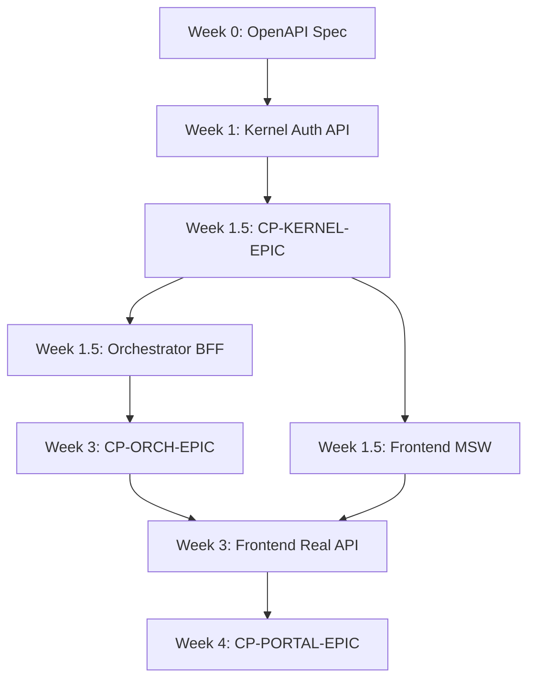

# Multi-Module Delivery Roadmap Template

## Purpose

Create a **structured delivery roadmap** for epics spanning multiple modules (Kernel → Orchestrator → Portal pipeline). This skill provides a template for sequencing work, identifying dependencies, and coordinating parallel tracks to minimize total delivery time while respecting module boundaries.

**ROI:** 8 weeks → 5 weeks delivery (37.5% faster with parallel development)

---

## When to Use

Trigger this skill when:
- Epic spans 3+ modules (e.g., Kernel auth, Orchestrator BFF, Portal login UI)
- Sequential delivery causes idle time (Frontend waiting for Backend)
- Parallel development possible (with checkpoints)
- Multi-terminal coordination needed

**DO NOT use** for:
- Single-module epics (no coordination needed)
- Fully independent features (no dependencies)
- Prototypes (no formal roadmap needed)

---

## Prerequisites

**Inputs:**
- Epic scope (list of deliverables per module)
- Module dependency graph (Kernel → Orchestrator → Portal)
- Checkpoint definitions (when can downstream start?)
- Team capacity (which terminals are available?)

**Tools:**
- `docs/projects/EPICS.yaml` (epic dependency tracking)
- Gantt chart (Datahaven Projects page)
- ROADMAP.md per module

---

## Step-by-Step

### Step 1: Decompose Epic by Module (1-2 hours)

**Template:**

```markdown
# Epic: [Name] — Multi-Module Delivery Roadmap

**Epic ID:** EPIC-[ID]
**Target Date:** YYYY-MM-DD
**Owner:** [Terminal coordinating this epic]

---

## Module Breakdown

### Kernel (Week 1-2)

**Deliverables:**
- [ ] [Feature 1] (e.g., Auth API endpoints)
- [ ] [Feature 2] (e.g., RLS policies for tenants)
- [ ] [Feature 3] (e.g., Audit event sourcing)

**Checkpoint:** CP-KERNEL-[EPIC]
- OpenAPI spec finalized
- Contract tests passing (Dredd 100%)
- Auth API deployed to dev

**Triggers:**
- Orchestrator starts Week 1.5 (after spec lock)
- Frontend starts Week 1.5 (with MSW mocks)

---

### Orchestrator (Week 1.5-3)

**Deliverables:**
- [ ] [Feature 1] (e.g., BFF endpoints for auth)
- [ ] [Feature 2] (e.g., LLM Tool Calling integration)
- [ ] [Feature 3] (e.g., Rate limiting middleware)

**Depends On:**
- CP-KERNEL-[EPIC] (OpenAPI spec)

**Checkpoint:** CP-ORCH-[EPIC]
- BFF endpoints deployed to dev
- Integration tests passing

**Triggers:**
- Frontend switches from MSW to real API (Week 3)

---

### Portal (Week 1.5-4)

**Deliverables:**
- [ ] [Feature 1] (e.g., Login form UI)
- [ ] [Feature 2] (e.g., TanStack Query hooks)
- [ ] [Feature 3] (e.g., RBAC guard routes)

**Depends On:**
- CP-KERNEL-[EPIC] (OpenAPI spec for MSW setup)
- CP-ORCH-[EPIC] (real API for integration)

**Parallel Development:**
- Week 1.5-3: MSW mock API (independent from Orchestrator)
- Week 3-4: Real API integration

**Checkpoint:** CP-PORTAL-[EPIC]
- UI screens complete
- Component tests passing (≥80%)

---

## Timeline

**Week 0 (Contract First):**
- Day 1-4: OpenAPI spec writing (Kernel + Orchestrator + Frontend)
- Day 4: Spec locked → code-gen setup (Orval, NSwag)

**Week 1 (Kernel Start):**
- Kernel implements auth API
- Orchestrator + Frontend setup MSW mocks

**Week 1.5 (Parallel Development Begins):**
- Kernel completes CP-KERNEL-[EPIC]
- Orchestrator starts BFF implementation
- Frontend starts UI development (MSW)

**Week 3 (Integration):**
- Orchestrator completes CP-ORCH-[EPIC]
- Frontend switches MSW → real API

**Week 4 (Done):**
- Frontend completes CP-PORTAL-[EPIC]
- E2E tests passing
- Epic DONE

---

## Parallel Tracks

| Track | Week 1 | Week 1.5 | Week 2 | Week 3 | Week 4 |
|-------|--------|----------|--------|--------|--------|
| **Kernel** | Auth API | ✅ DONE | — | — | — |
| **Orchestrator** | Spec | BFF start | BFF impl | ✅ DONE | — |
| **Frontend** | Spec | MSW setup | UI impl | Real API | ✅ DONE |

**Critical Path:** Kernel → Orchestrator → Frontend integration (5 weeks total)

**Parallelism:** Orchestrator + Frontend start Week 1.5 (vs Week 3 if sequential = 3 weeks saved)

---

## Dependency Graph



**Checkpoints enable parallelism** — Frontend doesn't wait for Orchestrator (MSW allows early start)

---

## Risk Mitigation

**Risk 1: Kernel delay (Week 1 → Week 2)**
- **Impact:** Orchestrator + Frontend delayed by 1 week
- **Mitigation:** CP-KERNEL-EPIC acceptance criteria clear (contract tests)
- **Workaround:** Frontend continues with MSW (no blocker)

**Risk 2: OpenAPI spec changes after Week 0**
- **Impact:** Rework in Orchestrator + Frontend
- **Mitigation:** Spec lock with formal approval (Architect + Backend + Frontend)
- **Workaround:** Minor changes → patch version (no rework)

**Risk 3: Frontend MSW → Real API swap fails**
- **Impact:** Week 4 integration blocked
- **Mitigation:** Contract tests ensure API compliance
- **Workaround:** Feature flag rollback to MSW

---

## Success Metrics

| Metric | Target | Measurement |
|--------|--------|-------------|
| **Total Delivery Time** | 5 weeks | Calendar days (Week 0 → Week 4 DONE) |
| **Parallelism Utilization** | ≥60% | (Parallel work) / (Total work) |
| **Idle Time** | 0 weeks | No terminal waiting for blocker |
| **Checkpoint Delays** | ≤2 days | CP-* completion vs target |
| **Rework** | 0% | No spec changes after Week 0 |

---

## Template Adaptation Guide

### For Backend-Only Epics (No Frontend)

```markdown
# Epic: [Name] — Multi-Module Delivery Roadmap

## Module Breakdown

### Kernel (Week 1-2)
- [Deliverables]
- **Checkpoint:** CP-KERNEL-[EPIC]
- **Triggers:** Orchestrator starts Week 2

### Orchestrator (Week 2-3)
- [Deliverables]
- **Depends On:** CP-KERNEL-[EPIC]
- **Checkpoint:** CP-ORCH-[EPIC]

**Total:** 3 weeks (vs 4 weeks sequential = 25% faster)
```

### For Frontend-Only Epics (No Backend Changes)

```markdown
# Epic: [Name] — Multi-Module Delivery Roadmap

## Module Breakdown

### Portal (Week 1-2)
- [Deliverables]
- **No dependencies** (UI-only feature)

**Total:** 2 weeks (no parallelism needed)
```

### For Infra + Backend + Frontend Epics

```markdown
# Epic: [Name] — Multi-Module Delivery Roadmap

## Module Breakdown

### Infra (Week 1)
- VPS setup, PostgreSQL config
- **Checkpoint:** CP-INFRA-[EPIC]
- **Triggers:** Kernel starts Week 1

### Kernel (Week 1-2)
- [Deliverables]
- **Depends On:** CP-INFRA-[EPIC]
- **Checkpoint:** CP-KERNEL-[EPIC]

### [Continue as normal...]

**Total:** 5 weeks (Infra parallel with Kernel start)
```

---

## Real-World Example

### EPIC-JT-CRM: CRM Module (5 weeks)

**Week 0 (June 30 - July 4):**
- Day 1: Endpoint inventory (14 endpoints)
- Day 2-3: OpenAPI spec writing (Lead, Opportunity schemas)
- Day 4: Spec locked v1.0.0

**Week 1 (July 7-11):**
- Kernel: Auth API + Lead/Opportunity aggregates
- Orchestrator: MSW setup
- Frontend: MSW setup

**Week 1.5 (July 14):**
- **CP-KERNEL-CRM reached** → OpenAPI spec finalized
- Orchestrator: BFF endpoints start
- Frontend: Lead/Opportunity UI start (MSW)

**Week 3 (July 28):**
- **CP-ORCH-CRM reached** → BFF deployed to dev
- Frontend: Switch MSW → real API

**Week 4 (August 4):**
- **CP-PORTAL-CRM reached** → UI complete
- E2E tests passing

**Outcome:**
- Total delivery: 5 weeks (vs 8 weeks sequential)
- Parallel development: Week 1.5-4 (60% of timeline)
- Zero idle time (Frontend always had work with MSW)

**ROI:**
- 3 weeks saved (37.5% faster)
- $12k cost avoidance (3 weeks × 3 FTE × $1.3k/week)

---

## Related Skills

- **checkpoint-coordination-workflow:** Automated checkpoint notifications
- **contract-first-development-workflow:** Week 0 OpenAPI spec
- **mock-api-parallel-development:** MSW setup for Frontend independence
- **fsm-aggregate-generator:** Kernel domain model creation

---

## Maintenance Notes

**When to update this skill:**
- New module added (e.g., Mobile app)
- Dependency patterns change (e.g., GraphQL instead of REST)
- Checkpoint automation improved

**Roadmap versioning:**
- Major version: Epic scope change (new module added)
- Minor version: Timeline adjustment (checkpoint delay)

---

**Skill Owner:** Librarian
**Created:** 2026-07-04
**Status:** ACTIVE — Use for all multi-module epics
