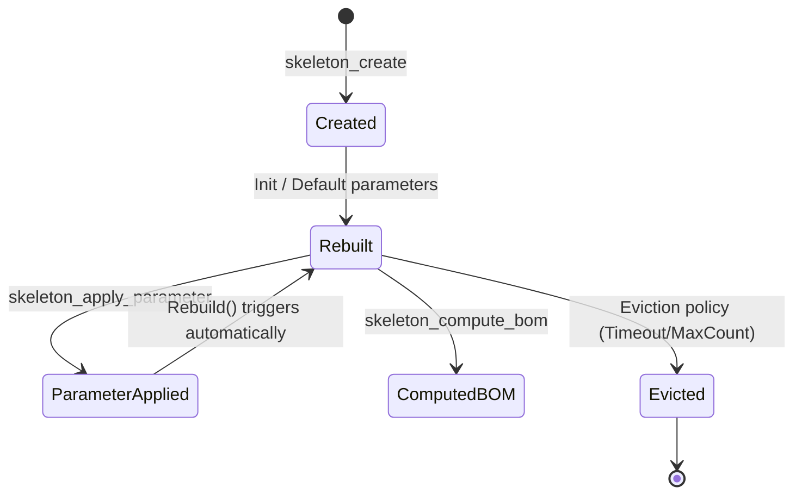

# CabinetBilder MCP-host PoC — MCP Tool-kontraktok és Életciklus Specifikáció (v1)

Ez a dokumentum rögzíti a `CabinetBilder.McpHost` konzolalkalmazás MCP (Model Context Protocol) tool-kontraktjainak, a Skeleton példányok in-memory életciklusának és a két különböző Result típus egységes JSON marshalling-jának architektúra-tervét.

A specifikáció szigorúan betartja a Gábor által meghatározott és a `plan/feature-mcphost-cabinetbilder-1.md` (REQ-006..REQ-008) dokumentumban rögzített kötelező tervezési elveket.

---

## 1. Kötelező tervezési elvek alkalmazása

### 1.1. Parametrikus tervezés elve (REQ-006)
A tool-kontraktok nem teszik lehetővé a direkt 3D geometria-szerkesztést (pl. sarokpontok kézi módosítása vagy új lapok manuális elhelyezése). Minden módosítás kizárólag a `Skeleton` paraméter-vezérelt modelljén keresztül történhet. A tervező ügynök vagy kliens paramétereket ad meg (szélesség, magasság, mélység, anyagvastagság stb.), amelyeket a Skeleton `ApplyParameter` metódusa fogad be, majd a `Rebuild()` metódus automatikusan újraszámolja a belső komponens-struktúrát (`SkeletonComponent` lista) a beépített asztalosipari szabályok szerint.

### 1.2. Egyszerű webes megjelenítés elve (REQ-007)
A toolok által visszaadott kimenetek (a szekrény állapota, paraméterek listája, a BOM-lista stb.) letisztult, standard, webre kész JSON-struktúrák. Kerüljük a bináris CAD-formátumokat (pl. DWG, DXF) vagy specifikus asztalos-CAD adatszerkezeteket. A kimenet közvetlenül renderelhető React/Vue felületeken vagy feldolgozható AI ágensek által.

### 1.3. Tervezői szándék gyűjtése (REQ-008)
A tervezési döntések mögötti megfontolások dokumentálására és a későbbi felülvizsgálatok megkönnyítésére két csatornán gyűjtjük a tervezői szándékot:
1. **Opcionális `intent` paraméter**: A skeleton állapotait módosító toolok (`skeleton_create` és `skeleton_apply_parameter`) kapnak egy opcionális `intent` szöveges mezőt.
2. **Dedicated `record_design_intent` tool**: Lehetővé teszi külön indoklások, megjegyzések vagy tervezői szándékok rögzítését egy adott Skeleton kontextusában, a paraméterek közvetlen módosítása nélkül is.
Ezeket a szándékokat a host naplózza és az aggregate metadata szekciójában strukturáltan eltárolja.

---

## 2. TASK-001: Az 5 PoC MCP-tool kontraktusai

Minden tool az MCP JSON-RPC standard szerinti input sémával rendelkezik, és a kimenete az egységesített Result JSON formátumot követi (lásd 4. szekció).

### 2.1. `skeleton_create`
Új paraméteres szekrény skeleton példányt hoz létre alapértelmezett paraméterekkel.

* **Input Schema (JSON Schema):**
```json
{
  "$schema": "http://json-schema.org/draft-07/schema#",
  "type": "object",
  "properties": {
    "skeletonId": {
      "type": "string",
      "format": "uuid",
      "description": "Az új skeleton egyedi azonosítója. Ha nincs megadva, a host generál egyet."
    },
    "name": {
      "type": "string",
      "default": "New Cabinet",
      "description": "A szekrény megnevezése."
    },
    "intent": {
      "type": "string",
      "description": "A szekrény létrehozásának célja vagy tervezői szándéka (pl. 'Konyhai alsó fiókos elem')."
    }
  },
  "required": []
}
```

* **Sikeres Output Struktúra (JSON):**
```json
{
  "isSuccess": true,
  "status": "Ok",
  "errors": [],
  "value": {
    "id": "8c6b738e-0f1e-4cb2-8c9a-b42d13fca317",
    "name": "New Cabinet",
    "createdAt": "2026-07-10T16:52:05Z",
    "updatedAt": "2026-07-10T16:52:05Z",
    "parameters": [
      { "key": "Width", "value": 600.0, "description": "Total cabinet width", "type": "Double" },
      { "key": "Height", "value": 720.0, "description": "Total cabinet height", "type": "Double" },
      { "key": "Depth", "value": 560.0, "description": "Total cabinet depth", "type": "Double" },
      { "key": "Thickness", "value": 18.0, "description": "Material thickness", "type": "Double" },
      { "key": "BackOffset", "value": 5.0, "description": "Back panel offset", "type": "Double" }
    ],
    "components": [
      {
        "name": "Side Left",
        "materialId": "",
        "width": 560.0,
        "height": 720.0,
        "thickness": 18.0,
        "posX": 0.0, "posY": 0.0, "posZ": 0.0,
        "normalX": 1.0, "normalY": 0.0, "normalZ": 0.0,
        "dirX": 0.0, "dirY": 1.0, "dirZ": 0.0
      },
      {
        "name": "Side Right",
        "materialId": "",
        "width": 560.0,
        "height": 720.0,
        "thickness": 18.0,
        "posX": 582.0, "posY": 0.0, "posZ": 0.0,
        "normalX": 1.0, "normalY": 0.0, "normalZ": 0.0,
        "dirX": 0.0, "dirY": 1.0, "dirZ": 0.0
      },
      {
        "name": "Bottom",
        "materialId": "",
        "width": 564.0,
        "height": 560.0,
        "thickness": 18.0,
        "posX": 18.0, "posY": 0.0, "posZ": 0.0,
        "normalX": 0.0, "normalY": 0.0, "normalZ": 1.0,
        "dirX": 1.0, "dirY": 0.0, "dirZ": 0.0
      },
      {
        "name": "Top",
        "materialId": "",
        "width": 564.0,
        "height": 560.0,
        "thickness": 18.0,
        "posX": 18.0, "posY": 0.0, "posZ": 702.0,
        "normalX": 0.0, "normalY": 0.0, "normalZ": 1.0,
        "dirX": 1.0, "dirY": 0.0, "dirZ": 0.0
      },
      {
        "name": "Back",
        "materialId": "",
        "width": 590.0,
        "height": 710.0,
        "thickness": 3.0,
        "posX": 5.0, "posY": 557.0, "posZ": 5.0,
        "normalX": 0.0, "normalY": 1.0, "normalZ": 0.0,
        "dirX": 1.0, "dirY": 0.0, "dirZ": 0.0
      }
    ],
    "intents": [
      {
        "timestamp": "2026-07-10T16:52:05Z",
        "intent": "Konyhai alsó fiókos elem"
      }
    ]
  }
}
```

### 2.2. `skeleton_apply_parameter`
Módosítja a megadott azonosítójú skeleton egyik paraméterét, majd lefuttatja a belső modellszámítást (Rebuild).

* **Input Schema (JSON Schema):**
```json
{
  "$schema": "http://json-schema.org/draft-07/schema#",
  "type": "object",
  "properties": {
    "skeletonId": {
      "type": "string",
      "format": "uuid",
      "description": "A módosítandó skeleton egyedi azonosítója."
    },
    "key": {
      "type": "string",
      "description": "A paraméter kulcsa (pl. 'Width', 'Height', 'Depth', 'Thickness', 'BackOffset')."
    },
    "value": {
      "type": ["number", "string", "boolean"],
      "description": "Az új érték (típusa a paraméter típusához kell igazodjon)."
    },
    "intent": {
      "type": "string",
      "description": "A paraméter módosításának szakmai indoklása (pl. 'Vásárlói kérésre megnövelve 800 mm-re')."
    }
  },
  "required": ["skeletonId", "key", "value"]
}
```

* **Output Struktúra (Sikeres paraméter-alkalmazás és Rebuild után):**
A visszatérési érték a frissített Skeleton JSON állapota (hasonlóan a `skeleton_create`-hez), de a módosított paraméterrel és az újraszámolt pozíciójú és méretű komponensekkel, valamint a bejegyzett intent-tel.

### 2.3. `skeleton_compute_bom`
Kiszámítja és lapos listaként visszaadja a megadott skeleton komponenseiből származó Anyagjegyzéket (BOM).

* **Input Schema (JSON Schema):**
```json
{
  "$schema": "http://json-schema.org/draft-07/schema#",
  "type": "object",
  "properties": {
    "skeletonId": {
      "type": "string",
      "format": "uuid",
      "description": "A skeleton egyedi azonosítója."
    }
  },
  "required": ["skeletonId"]
}
```

* **Sikeres Output Struktúra (JSON):**
```json
{
  "isSuccess": true,
  "status": "Ok",
  "errors": [],
  "value": [
    {
      "name": "Side Left",
      "length": 720.0,
      "width": 560.0,
      "thickness": 18.0,
      "materialId": "laminated-board-white",
      "quantity": 1,
      "edgingId": null,
      "comments": null
    },
    {
      "name": "Side Right",
      "length": 720.0,
      "width": 560.0,
      "thickness": 18.0,
      "materialId": "laminated-board-white",
      "quantity": 1,
      "edgingId": null,
      "comments": null
    },
    {
      "name": "Bottom",
      "length": 564.0,
      "width": 560.0,
      "thickness": 18.0,
      "materialId": "laminated-board-white",
      "quantity": 1,
      "edgingId": null,
      "comments": null
    },
    {
      "name": "Top",
      "length": 564.0,
      "width": 560.0,
      "thickness": 18.0,
      "materialId": "laminated-board-white",
      "quantity": 1,
      "edgingId": null,
      "comments": null
    },
    {
      "name": "Back",
      "length": 710.0,
      "width": 590.0,
      "thickness": 3.0,
      "materialId": "hdf-back-panel",
      "quantity": 1,
      "edgingId": null,
      "comments": null
    }
  ]
}
```

### 2.4. `get_store_stats`
Lekérdezi az SQLite alapú lokális tároló statisztikáit és egészségi állapotát (`ILocalStore.GetStoreStatsAsync` port alapján).

* **Input Schema (JSON Schema):**
```json
{
  "$schema": "http://json-schema.org/draft-07/schema#",
  "type": "object",
  "properties": {},
  "required": []
}
```

* **Sikeres Output Struktúra (JSON):**
```json
{
  "isSuccess": true,
  "status": "Ok",
  "errors": [],
  "value": {
    "schemaVersion": 1,
    "integrityCheck": "ok",
    "templateCacheCount": 14,
    "materialCacheCount": 85,
    "seenGuidsCount": 24,
    "outboxPending": 3,
    "outboxSucceededLast30d": 142,
    "outboxFailed": 1
  }
}
```

### 2.5. `get_connection_status`
Lekéri a SpaceOS cloud kapcsolódási státuszát és a bejelentkezett felhasználó adatait.

* **Input Schema (JSON Schema):**
```json
{
  "$schema": "http://json-schema.org/draft-07/schema#",
  "type": "object",
  "properties": {},
  "required": []
}
```

* **Sikeres Output Struktúra (JSON):**
```json
{
  "isSuccess": true,
  "status": "Ok",
  "errors": [],
  "value": {
    "status": "Online",
    "activeTenantId": "tenant-doorstar-kft",
    "userDisplayName": "Gábor Kovács",
    "lastSyncTime": "2026-07-10T16:45:12.110Z"
  }
}
```

### 2.6. Bónusz: `record_design_intent`
Mivel a REQ-008 opcionális intent mezőt VAGY önálló `record_design_intent` toolt ír elő, mindkét megközelítést támogatjuk a maximális megfelelés érdekében. Ezzel a toollal utólagosan is rögzíthetünk indoklásokat.

* **Input Schema (JSON Schema):**
```json
{
  "$schema": "http://json-schema.org/draft-07/schema#",
  "type": "object",
  "properties": {
    "skeletonId": {
      "type": "string",
      "format": "uuid",
      "description": "A cél skeleton azonosítója."
    },
    "intent": {
      "type": "string",
      "description": "A tervezői döntés / szándék részletes leírása."
    },
    "parameterKey": {
      "type": "string",
      "description": "Opcionális. Ha a szándék egy konkrét paraméterhez kapcsolódik."
    }
  },
  "required": ["skeletonId", "intent"]
}
```

---

## 3. TASK-002: Skeleton életciklus specifikáció

Mivel az stdio transporton futó MCP szerver egy állapotőrző (stateful) folyamat a gazdagép (pl. Claude Code ágens) alatt, a futása közben egy memóriabeli nyilvántartást (registry) tart fenn a kezelt Skeleton példányokról.

### 3.1. Registry struktúra és Konkurencia-kezelés
A host processben a skeletonokat egy thread-safe kollekcióban tároljuk:
```csharp
private readonly ConcurrentDictionary<SkeletonId, Skeleton> _skeletonRegistry = new();
```
* **Thread-Safety**: Az MCP-host párhuzamosan kaphat kéréseket (pl. több tool hívás egy időben). A `ConcurrentDictionary` garantálja a registry szintű szálbiztosságot az írás/olvasás során.
* **Aggregátum zárolás (Fine-grained locking)**: Amikor egy meglévő skeleton paramétereit módosítjuk (`ApplyParameter`), az aggregátum konzisztenciájának megőrzése érdekében zárolni kell az adott példányt az újraszámítás és mentés idejére. Ezt egy belső lock objektummal vagy egy segéd dictionary-ből származó lock objektummal végezzük.

### 3.2. Életciklus fázisok


1. **Létrehozás (Create)**: A `skeleton_create` tool hívásakor létrejön egy `new Skeleton(id)` objektum. Ez betölti az alapértelmezett paramétereket, lefut az első `Rebuild()`, majd bekerül a registry-be.
2. **Kérdezés (Query)**: A `skeleton_compute_bom` vagy egyéb paraméter lekérdezések a registry-ből olvassák ki az aggregátumot O(1) idő alatt.
3. **Módosítás (Update)**: A `skeleton_apply_parameter` megkeresi a példányt a registry-ben, zárolja azt, végrehajtja az `ApplyParameter(...)` hívást, mely belsőleg kiváltja a `Rebuild()` futását, majd frissíti a registry-ben tárolt referenciát és frissíti a `UpdatedAt` időbélyeget.
4. **Megszüntetés/Tisztítás (Eviction / Cleanup)**: 
   * **PoC szinten**: A példányok a host process leállásáig memóriában maradnak (az `ASSUMPTION-001` szerint ez elegendő).
   * **Termelési szinten**: A memóriaszivárgás megelőzésére bevezetünk egy LRU (Least Recently Used) alapú eviction policy-t. Ha a registry mérete meghaladja az 1000 darabot, vagy egy skeleton nem módosult az elmúlt 60 percben, eltávolítjuk a memóriából.

---

## 4. TASK-003: Result -> JSON marshalling terv

Az alkalmazásban két alapvetően eltérő `Result` típus él:
1. `CabinetBilder.Core.Common.Result` (egyedi, belső domain Result a Core-ból)
2. `Ardalis.Result.Result` (külső NuGet csomag persistence és use-case rétegekhez)

Hogy az MCP kliensek (és a webes felület) egységesen tudják értelmezni a válaszokat, a host a kimenő JSON válasz előtt egy közös wrapper típusra (`McpToolResponse<T>`) képezi le mindkét típust.

### 4.1. Egységes JSON Válaszstruktúra
```json
{
  "isSuccess": true,
  "status": "Ok", 
  "errors": [],
  "validationErrors": [],
  "value": {} 
}
```
* `isSuccess`: boolean. `true` sikeres végrehajtás esetén.
* `status`: string. Lehetséges értékek: `"Ok"`, `"NotFound"`, `"Invalid"`, `"Unauthorized"`, `"Forbidden"`, `"Error"`.
* `errors`: string tömb. Globális vagy általános hibaüzenetek listája.
* `validationErrors`: Mezőspecifikus validációs hibák objektum-tömbje.
  * `identifier`: a hibás mező/paraméter neve.
  * `errorMessage`: a hiba leírása.
* `value`: a kért adatok (pl. Skeleton objektum, BomLine tömb vagy statisztikák), sikertelen hívás esetén `null` vagy elhagyott.

### 4.2. Leképzési logika (Mapping)

#### 4.2.1. `CabinetBilder.Core.Common.Result` leképzése
Mivel ez a típus egyszerűbb (csak sikeresség és egyetlen szöveges hibaüzenet áll rendelkezésre), a leképzés az alábbi:
* Ha `IsSuccess` igaz:
  * `isSuccess = true`
  * `status = "Ok"`
  * `errors = []`
* Ha `IsFailure` igaz:
  * `isSuccess = false`
  * `status = "Error"`
  * `errors = [ ErrorMessage ]`

#### 4.2.2. `Ardalis.Result` leképzése
Ez a típus gazdag státuszkészlettel és strukturált validációs hibákkal rendelkezik:
* `status` mező transzformációja:
  * `ResultStatus.Ok` -> `"Ok"`
  * `ResultStatus.NotFound` -> `"NotFound"`
  * `ResultStatus.Invalid` -> `"Invalid"`
  * `ResultStatus.Unauthorized` -> `"Unauthorized"`
  * `ResultStatus.Forbidden` -> `"Forbidden"`
  * `ResultStatus.Error` -> `"Error"`
  * `ResultStatus.CriticalError` -> `"Error"`
* `errors` feltöltése: Az `Errors` kollekció elemeit közvetlenül másoljuk át.
* `validationErrors` feltöltése: A `ValidationErrors` listában lévő elemeket (`ValidationError` típus) leképezzük:
  * `identifier = ValidationError.Identifier`
  * `errorMessage = ValidationError.ErrorMessage`

### 4.3. C# Implementációs Terv (Extension Methods)

A hostban az alábbi kiterjesztő metódusokat használjuk a zökkenőmentes marshallinghoz:

```csharp
using System.Text.Json;
using System.Text.Json.Serialization;

namespace CabinetBilder.McpHost.Serialization;

public sealed class McpToolResponse<T>
{
    public bool IsSuccess { get; set; }
    public string Status { get; set; } = "Ok";
    public List<string> Errors { get; set; } = new();
    public List<McpValidationError> ValidationErrors { get; set; } = new();
    public T? Value { get; set; }
}

public sealed class McpValidationError
{
    public string Identifier { get; set; } = string.Empty;
    public string ErrorMessage { get; set; } = string.Empty;
}

public static class ResultExtensions
{
    // Core.Common.Result generic mapping
    public static McpToolResponse<T> ToMcpResponse<T>(this CabinetBilder.Core.Common.Result<T> domainResult)
    {
        return new McpToolResponse<T>
        {
            IsSuccess = domainResult.IsSuccess,
            Status = domainResult.IsSuccess ? "Ok" : "Error",
            Errors = domainResult.IsFailure && !string.IsNullOrEmpty(domainResult.ErrorMessage)
                ? new List<string> { domainResult.ErrorMessage } 
                : new List<string>(),
            Value = domainResult.IsSuccess ? domainResult.Value : default
        };
    }

    // Core.Common.Result non-generic mapping
    public static McpToolResponse<object> ToMcpResponse(this CabinetBilder.Core.Common.Result domainResult)
    {
        return new McpToolResponse<object>
        {
            IsSuccess = domainResult.IsSuccess,
            Status = domainResult.IsSuccess ? "Ok" : "Error",
            Errors = domainResult.IsFailure && !string.IsNullOrEmpty(domainResult.ErrorMessage)
                ? new List<string> { domainResult.ErrorMessage } 
                : new List<string>(),
            Value = null
        };
    }

    // Ardalis.Result generic mapping
    public static McpToolResponse<T> ToMcpResponse<T>(this Ardalis.Result.IResult<T> ardalisResult)
    {
        var response = new McpToolResponse<T>
        {
            IsSuccess = ardalisResult.IsSuccess,
            Status = MapArdalisStatus(ardalisResult.Status),
            Errors = ardalisResult.Errors.ToList(),
            Value = ardalisResult.IsSuccess ? ardalisResult.Value : default
        };

        if (ardalisResult.ValidationErrors != null)
        {
            response.ValidationErrors = ardalisResult.ValidationErrors.Select(v => new McpValidationError
            {
                Identifier = v.Identifier,
                ErrorMessage = v.ErrorMessage
            }).ToList();
        }

        return response;
    }

    // Ardalis.Result non-generic mapping
    public static McpToolResponse<object> ToMcpResponse(this Ardalis.Result.IResult ardalisResult)
    {
        var response = new McpToolResponse<object>
        {
            IsSuccess = ardalisResult.IsSuccess,
            Status = MapArdalisStatus(ardalisResult.Status),
            Errors = ardalisResult.Errors.ToList(),
            Value = null
        };

        if (ardalisResult.ValidationErrors != null)
        {
            response.ValidationErrors = ardalisResult.ValidationErrors.Select(v => new McpValidationError
            {
                Identifier = v.Identifier,
                ErrorMessage = v.ErrorMessage
            }).ToList();
        }

        return response;
    }

    private static string MapArdalisStatus(Ardalis.Result.ResultStatus status)
    {
        return status switch
        {
            Ardalis.Result.ResultStatus.Ok => "Ok",
            Ardalis.Result.ResultStatus.NotFound => "NotFound",
            Ardalis.Result.ResultStatus.Invalid => "Invalid",
            Ardalis.Result.ResultStatus.Unauthorized => "Unauthorized",
            Ardalis.Result.ResultStatus.Forbidden => "Forbidden",
            _ => "Error"
        };
    }
}
```
